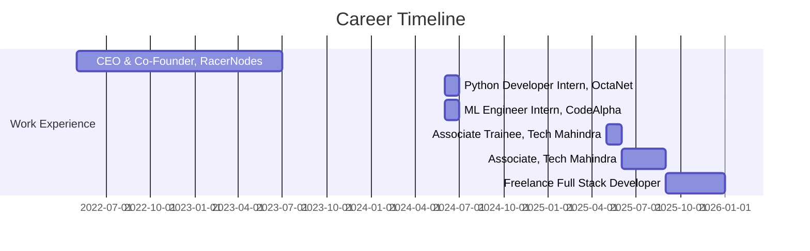

<div align="center">

# 👋 Hey there! I'm Sai Dutta Abhishek Dash

### 🚀 Full Stack Developer | 🤖 AI/ML Engineer | 🔒 Security Expert


[](https://sdad.pro)
[](mailto:contact@sdad.pro)
[](https://linkedin.com/in/sdabhishekdash)
[](https://twitter.com/abhishekdash69)


</div>

---

## 💫 About Me

```typescript
const saiDutta = {
    location: "Bhubaneswar, Odisha 🇮🇳",
    currentRole: "Freelance Full Stack Developer",
    previousCompany: "Tech Mahindra",
    education: "B.Tech in Computer Science - GIET University",
    
    specialties: [
        "🤖 AI/ML Engineering",
        "🔐 Zero-Knowledge Encryption",
        "☁️ Cloud Architecture (AWS Certified)",
        "🛡️ Security Engineering",
        "⚡ Full Stack Development"
    ],
    
    stats: {
        productionApps: "20+",
        yearsOfExperience: "3+",
        companiesWorkedWith: "10+",
        startupsFoundedAndLed: 1
    },
    
    currentlyBuilding: "Enterprise AI-powered tools",
    openToWork: true,
    availableFor: ["Freelance Projects", "Consulting", "Collaborations"]
};
```

---

## 🛠️ Tech Arsenal

<details open>
<summary><b>🎨 Frontend Development</b></summary>
<br>


</details>

<details open>
<summary><b>⚙️ Backend & APIs</b></summary>
<br>


</details>

<details open>
<summary><b>🤖 AI/ML & Data Science</b></summary>
<br>


</details>

<details open>
<summary><b>☁️ Cloud & DevOps</b></summary>
<br>


</details>

<details open>
<summary><b>💾 Databases & Storage</b></summary>
<br>


</details>

---

## 🚀 Featured Projects

<table>
<tr>
<td width="50%">

### 🔐 Binify - Zero-Knowledge Encrypted Pastebin
<a href="https://bin.sdad.pro">

</a>

**Client-side encryption ensures absolute privacy—even we can't read your pastes.**

🛠️ **Stack:**
- Next.js 15
- Turso Database
- Upstash Redis
- Web Crypto API

⭐ **Key Features:**
- End-to-end encryption
- Zero-knowledge architecture
- Self-destructing pastes

</td>
<td width="50%">

### 🌐 PacketBuddy - Network Monitor
<a href="https://github.com/instax-dutta/packet-buddy">

</a>

**Ultra-lightweight bandwidth monitor with real-time stats and cost tracking.**

🛠️ **Stack:**
- Python
- JavaScript
- NeonDB
- Chart.js

⭐ **Key Features:**
- Zero configuration required
- Real-time bandwidth monitoring
- Cost tracking & analytics

</td>
</tr>

<tr>
<td width="50%">

### 🧠 GenieLabs - AI Dev Platform
<a href="https://genielabs.sdad.pro">

</a>

**AI-powered platform for code generation, analysis, and optimization.**

🛠️ **Stack:**
- Next.js 14
- TypeScript 5
- AI Agent Integration

⭐ **Key Features:**
- Intelligent code generation
- Real-time code analysis
- Performance optimization

</td>
<td width="50%">

### 🛡️ VullScanny - Security Scanner
<a href="https://vullscanny.sdad.pro">

</a>

**AI-powered security vulnerability scanner with instant analysis.**

🛠️ **Stack:**
- Next.js 16
- PWA
- Turbopack

⭐ **Key Features:**
- Zero-config setup
- Instant vulnerability reports
- AI-powered analysis

</td>
</tr>
</table>

---

## 💼 Professional Journey



### 🏆 Key Achievements

- 🚀 **20+ Production-Ready Applications** built and deployed
- 🎯 **15% Improvement** in ML model prediction accuracy
- ⚡ **40% Reduction** in manual work through automation
- 👥 **Led team of 5+** members as CEO of RacerNodes
- ☁️ **AWS Certified** Cloud Practitioner
- 🔒 **Enterprise Security** solutions implemented

---

## 📊 GitHub Analytics

<div align="center">


### 🏆 GitHub Trophies


### 📈 Top Languages


</div>

---

## 🎓 Certifications & Learning

<details>
<summary><b>🏅 Click to view all certifications</b></summary>
<br>

| Certification | Issuer | Year |
|--------------|--------|------|
| 🤖 AWS Bedrock Workshop (Build a Gen AI Chatbot) | Udemy | 2024 |
| ☁️ AWS Cloud Practitioner | AWS | 2024 |
| 🔧 Amazon Bedrock Getting Started | AWS | 2024 |
| 💻 Amazon Q Developer | AWS | 2024 |
| 🐍 Python 3: Programming beginner to advanced | Udemy | 2024 |
| 📊 Python For Data Science and Machine Learning | Udemy | 2024 |
| 🧠 Planning a Machine Learning Project | AWS | 2024 |
| 📋 Project Management | LearnTube | 2024 |

</details>

---

## 🌟 What I'm Up To

```javascript
const currentFocus = {
    learning: ["Advanced AI/ML", "Web3", "Rust"],
    building: ["12Labs - Enterprise AI Suite", "Open Source Projects"],
    exploring: ["Zero-Knowledge Proofs", "Edge Computing"],
    contributing: "Open Source Security Tools"
};
```

### 📫 Let's Connect!

<div align="center">

[](https://sdad.pro)
[](https://linkedin.com/in/sdabhishekdash)
[](https://twitter.com/abhishekdash69)
[](https://github.com/instax-dutta)
[](mailto:contact@sdad.pro)
[](https://discord.gg/mFWSp38kev)

### 💖 Support My Work

[](https://buymeacoffee.com/sdad)
[](https://paypal.me/zeusfield)

---


### ⚡ "Building the future, one commit at a time"


</div>
